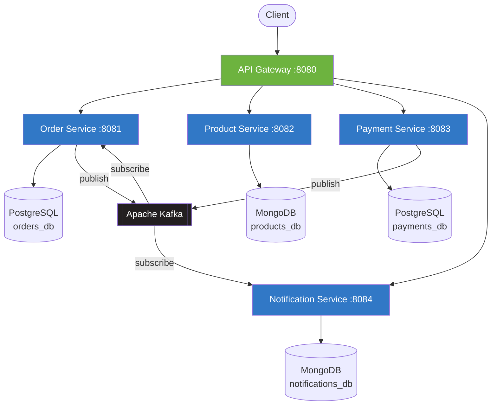

# E-Commerce Microservices Platform


A cloud-native e-commerce platform built with microservices architecture. Features service discovery, API gateway, distributed tracing, and container orchestration with Kubernetes.

---

## Architecture



## Services

| Service                | Port | Description                              | Database   |
|------------------------|------|------------------------------------------|------------|
| **api-gateway**        | 8080 | Routes and load-balances incoming traffic | --         |
| **order-service**      | 8081 | Order lifecycle management                | PostgreSQL |
| **product-service**    | 8082 | Product catalog and inventory             | MongoDB    |
| **payment-service**    | 8083 | Payment processing and transactions       | PostgreSQL |
| **notification-service** | 8084 | Email/SMS notifications via event streams | MongoDB    |

## Tech Stack

- **Language:** Java 17
- **Framework:** Spring Boot 3.2, Spring Cloud Gateway
- **Messaging:** Apache Kafka
- **Databases:** PostgreSQL, MongoDB
- **Containers:** Docker, Kubernetes, Helm
- **Monitoring:** Prometheus, Grafana
- **Tracing:** Micrometer + Zipkin
- **Build:** Maven

## Quick Start

### Using Docker Compose

```bash
# Clone the repository
git clone https://github.com/enriquevaldivia1988/microservices-k8s.git
cd microservices-k8s

# Build and start all services
docker-compose up --build -d

# Verify services are running
docker-compose ps
```

### Using Kubernetes

```bash
# Create the namespace
kubectl apply -f k8s/namespace.yaml

# Apply the ConfigMap
kubectl apply -f k8s/configmap.yaml

# Deploy infrastructure
kubectl apply -f k8s/kafka-deployment.yaml

# Deploy application services
kubectl apply -f k8s/order-service-deployment.yaml
kubectl apply -f k8s/product-service-deployment.yaml
kubectl apply -f k8s/payment-service-deployment.yaml
kubectl apply -f k8s/notification-service-deployment.yaml
kubectl apply -f k8s/api-gateway-deployment.yaml

# Verify all pods are running
kubectl get pods -n ecommerce
```

### Access

| Endpoint          | URL                        |
|-------------------|----------------------------|
| API Gateway       | http://localhost:8080       |
| Prometheus        | http://localhost:9090       |
| Grafana           | http://localhost:3000       |

## Project Structure

```
microservices-k8s/
├── api-gateway/
├── order-service/
├── product-service/
├── payment-service/
├── notification-service/
├── k8s/
│   ├── namespace.yaml
│   ├── configmap.yaml
│   ├── kafka-deployment.yaml
│   └── *-deployment.yaml
├── docker-compose.yml
└── README.md
```

## Author

**Enrique Valdivia Rios**
- GitHub: [@enriquevaldivia1988](https://github.com/enriquevaldivia1988)
- LinkedIn: [enrique-valdivia-rios](https://linkedin.com/in/enrique-valdivia-rios)
- Web: [enriquevaldivia.dev](https://enriquevaldivia.dev)

## License

This project is licensed under the MIT License. See the [LICENSE](LICENSE) file for details.
